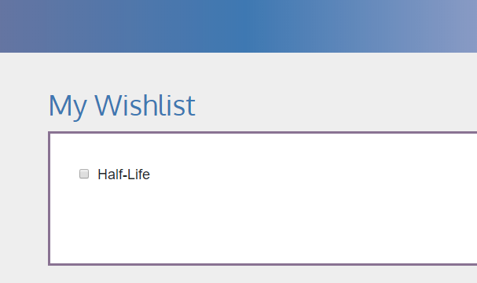

# GameHub
GameHub serves as the central hub for both gamers and those who want to learn more about games available on Steam. It’s primary goal is to provide and clarify information about the particular game searched by the user. GameHub effectively displays in a visually appealing way specific details of a searched game.

GameHub was designed for those who
1. want to visit a gaming website that is primarialy visual
2. are looking for a quick metacritic review
3. to see if a specific game is appropriate for their child based on graphics and ratings

## Prerequisites
In order for GameHub to properly function, the user must install the Chrome Extension CORS Toggle.
  
To do so, search **CORS Toggle** in the Chrome Web Store.
  

  
Once the extension is found, click on **ADD TO CHROME** to complete the installation process.

  
Make sure to check whether or not the extension is working properly in settings.

## Usage
After performing a <a href="https://help.github.com/articles/cloning-a-repository/">**git clone**</a>, the user will be able to access GameHub.
 
 
**Searching for a game** 
The user will type which game they would like to find into search field 
 
Once the user has clicked submit, they will be presented with selectable options matching the text they put in. 
 
 
**Wishlist** 
Once they are able to find the game you want, they are able to add it to their wishlist with the button below. 
 
To see if it was added correctly, they can click on 'My Wishlist' in the top right corner of the page. 
 
 
**Contacting GameHub** 
If the user would like to contact GameHub, a contact form is provided. All inputs are received and reviewed by us. 
 

## Built With
GameHub was created with the following APIs, Libraries and Databases: 
*<a href="https://steamcommunity.com/dev">Steam API</a>  
*<a href="https://developers.google.com/youtube/">YouTube API</a>  
*<a href="https://getbootstrap.com/">Bootstrap v4.1.1</a> 
*<a href="https://fonts.google.com/">Google Fonts</a>  
*<a href="https://daneden.github.io/animate.css/">Animate.CSS</a>  
*<a href="https://firebase.google.com/">Firebase</a>

## Authors
Andrew Hojonowski, Cong Nguyen, Megan Pellegrino-Zubricky, and Justin Verterano

## License and or Acknowledgements
Logo Icon credited to <a href="http://www.iconarchive.com/show/nuoveXT-2-icons-by-saki/Apps-preferences-system-windows-icon.html">NuoveXT 2 Icon Set</a>  
Logo created with <a href="https://www.1001fonts.com/liquid-font.html">Liquid Font</a>
